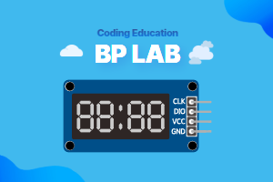

# 7-Segment Display Extension for MakeCode



This extension allows you to control TM1637 based 4-digit 7-segment LED displays with the micro:bit.

## Use as Extension

This repository can be added as an **extension** in MakeCode.

- open [https://makecode.microbit.org/](https://makecode.microbit.org/)
- click on **New Project**
- click on **Extensions** under the gearwheel menu
- search for **bplab-dev/pxt-bplab-seven-segment** and import

## 🚀 Features

- Easy control of TM1637 LED displays
- Support for up to 4 digits
- Display numbers and hexadecimal values
- Adjustable brightness control
- Show/hide decimal points
- Simple on/off control
- Can be registered as a MakeCode extension for easy use
- Support for Korean

## Blocks

### 🔍 Summary: What each block does

| **Block ID**                 | **Function**                                   |
|-----------------------------|-----------------------------------------------|
| [`create`](#1-create-display-block) | Initialize a new TM1637 LED display |
| [`showNumber`](#2-show-number-block) | Display a decimal number |
| [`showHex`](#3-show-hex-number-block) | Display a hexadecimal number |
| [`showbit`](#4-show-digit-block) | Show a single digit at specific position |
| [`showDP`](#5-show-decimal-point-block) | Show/hide decimal point |
| [`intensity`](#6-set-intensity-block) | Set display brightness |
| [`clear`](#7-clear-display-block) | Clear the display |
| [`on`](#8-display-onoff-blocks) | Turn display on |
| [`off`](#8-display-onoff-blocks) | Turn display off |

### 1. Create Display Block

- 🔹 Description
  - Initializes a new TM1637 LED display
  - Sets up communication pins and initial brightness
  - Default LED count is 4 digits

- 🔹 Parameters
  - `clk`: Clock pin (default: P12)
  - `dio`: Data pin (default: P13)
  - `intensity`: Brightness level (0-7)
  - `count`: Number of digits (1-4)

- ✅ Usage example

  ```blocks
  let tm = TM1637.create(DigitalPin.P12, DigitalPin.P13, 7, 4)
  ```

### 2. Show Number Block

- 🔹 Description
  - Displays a decimal number
  - Handles negative numbers
  - Supports up to 4 digits

- ✅ Usage example

  ```blocks
  let tm = TM1637.create(DigitalPin.P12, DigitalPin.P13, 7, 4)
  tm.showNumber(1234)
  tm.showNumber(-123)
  ```

### 3. Show Hex Number Block

- 🔹 Description
  - Displays a hexadecimal number
  - Supports values from 0 to FFFF
  - Shows negative numbers with minus sign

- ✅ Usage example

  ```blocks
  let tm = TM1637.create(DigitalPin.P12, DigitalPin.P13, 7, 4)
  tm.showHex(0xABCD)
  ```

### 4. Show Digit Block

- 🔹 Description
  - Shows a single digit at specified position
  - Position starts from 0 (leftmost)
  - Supports numbers 0-9 and hex digits A-F

- ✅ Usage example

  ```blocks
  let tm = TM1637.create(DigitalPin.P12, DigitalPin.P13, 7, 4)
  tm.showbit(5, 0)
  ```

### 5. Show Decimal Point Block

- 🔹 Description
  - Shows or hides decimal point at specified position
  - Does not affect the displayed digit

- ✅ Usage example

  ```blocks
  let tm = TM1637.create(DigitalPin.P12, DigitalPin.P13, 7, 4)
  tm.showDP(true)
  ```

### 6. Set Intensity Block

- 🔹 Description
  - Sets the brightness of the display
  - Range: 0 (off) to 8 (brightest)

- ✅ Usage example

  ```blocks
  let tm = TM1637.create(DigitalPin.P12, DigitalPin.P13, 7, 4)
  tm.intensity(5)
  ```

### 7. Clear Display Block

- 🔹 Description
  - Clears all digits on the display
  - Resets internal buffer

- ✅ Usage example

  ```blocks
  let tm = TM1637.create(DigitalPin.P12, DigitalPin.P13, 7, 4)
  tm.clear()
  ```

### 8. Display ON/OFF Blocks

- 🔹 Description
  - Controls display power state
  - Maintains display memory when off

- ✅ Usage example

  ```blocks
  let tm = TM1637.create(DigitalPin.P12, DigitalPin.P13, 7, 4)
  tm.on()
  tm.off()
  ```

## 📜 License

MIT License

## 💡 About BPLab

BPLab is a specialized company that provides coding education that anyone can easily learn. We provide in-person and online coding education for children, teens, adults, institutions, organizations, small groups, and schools in Korea in various fields such as IoT, artificial intelligence, micro:bit and Arduino.

We are also leading the way in developing and distributing coding education kits that allow learners to build, program, and experience the principles of coding. These kits utilize microcontrollers such as Arduino and micro:bit, as well as various sensors. This micro:bit extension is available for use in courses taught by BPLab.

Visit our websites:

- Korea: [https://bplab.kr](https://bplab.kr)
- Global: [https://bplab-us.com](https://bplab-us.com)
- Japan: [https://bplab-jp.com](https://bplab-jp.com)

## 📍 Supported targets

- for PXT/microbit

<script src="https://makecode.com/gh-pages-embed.js"></script><script>makeCodeRender("{{ site.makecode.home_url }}", "{{ site.github.owner_name }}/{{ site.github.repository_name }}");</script>
